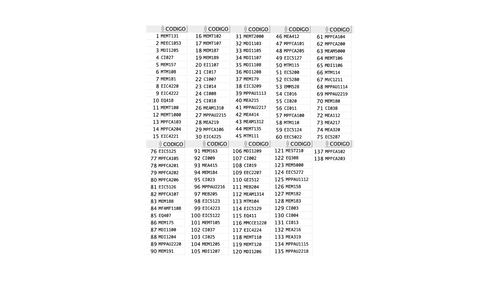
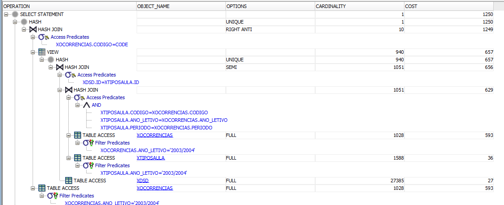
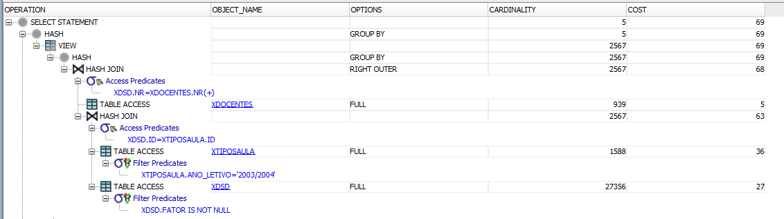

# Results XTables

Time to build: 7.30 seconds (Create Tables)

## Question1:

All Rows fetched: 6 in 0,032 seconds -- Average time

### Results:

### ExplainPlan

## Question 2 

All Rows fetched: 3 in 0,039 seconds -- Average time

### Results:

### ExplainPlan

## Question 3 

## A- Using NOT IN
All Rows fetched: 138 in 0.102 seconds -- Average time

### Results:

### ExplainPlan

## B- Using EXTERNAL JOIN
All Rows fetched: 138 in 0.098 seconds -- Average time

### Results:

### ExplainPlan

## Question 4 

All Rows fetched: 4 in 0,035 seconds -- Average time

### Results:

### ExplainPlan

## Question 6 

All Rows fetched: 4 in 0,046 seconds -- Average time

### Results:

### ExplainPlan

