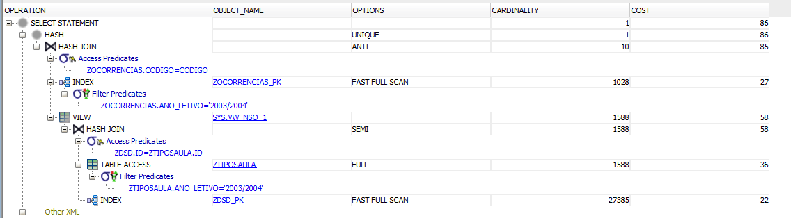
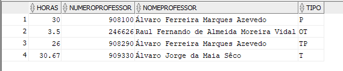

# Results ZTables

Time to build: 11.28 seconds (Create Tables)

## Question1:

All Rows fetched: 6 in 0,041 seconds -- Average time

### Results:

### ExplainPlan

## Question 2 

All Rows fetched: 3 in 0,029 seconds -- Average time

### Results:

### ExplainPlan

## Question 3 

## A- Using NOT IN
All Rows fetched: 138 in 0,084 seconds -- Average time

### Results:

### ExplainPlan

## B- Using EXTERNAL JOIN
All Rows fetched: 138 in 0,080 seconds -- Average time

### Results:

### ExplainPlan

## Question 4 

All Rows fetched: 4 in 0,038 seconds -- Average time

### Results:

### ExplainPlan

## Question 5

## A - Using B-tree

All Rows fetched: 2 in 0,002 seconds -- Average time

### Results:

### ExplainPlan

## A - Using Bitmap

All Rows fetched: 2 in 0,005 seconds -- Average time

### Results:

### ExplainPlan

## Question 6 

All Rows fetched: 4 in 0,051 seconds -- Average time

### Results:

### ExplainPlan

