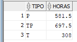
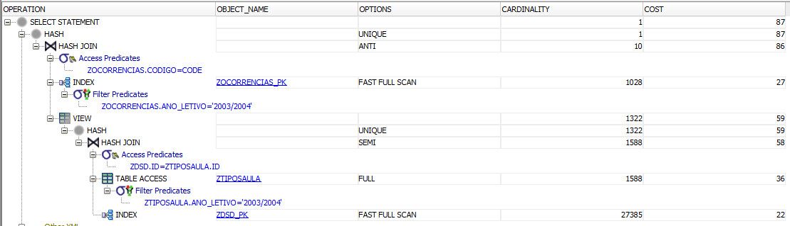
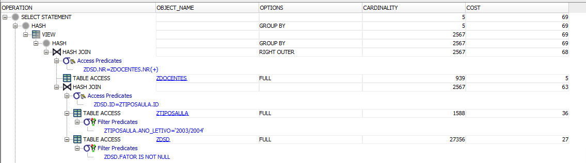
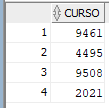

# Results ZTables

Time to build: 11.28 seconds (Create Tables)

## Question1:

All Rows fetched: 6 in 0,041 seconds -- Average time

### Results:

### ExplainPlan

## Question 2 

All Rows fetched: 3 in 0,035 seconds -- Average time

### Results:

### ExplainPlan

## Question 3 

## A- Using NOT IN
All Rows fetched: 138 in 0,107 seconds -- Average time

### Results:

### ExplainPlan

## B- Using EXTERNAL JOIN
All Rows fetched: 138 in 0,091 seconds -- Average time

### Results:

### ExplainPlan

## Question 4 

All Rows fetched: 4 in 0,044 seconds -- Average time

### Results:

### ExplainPlan

## Question 6 

All Rows fetched: 4 in 0,058 seconds -- Average time

### Results:

### ExplainPlan

